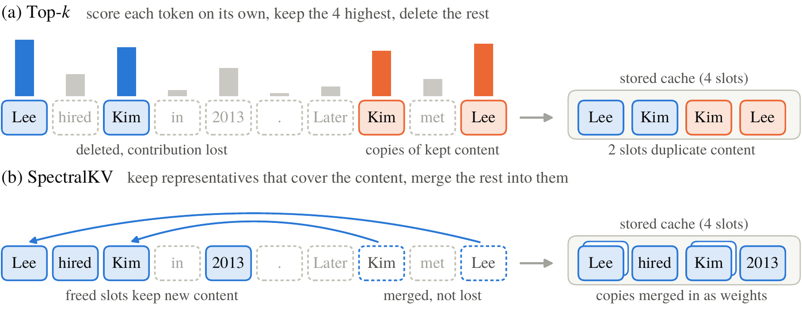
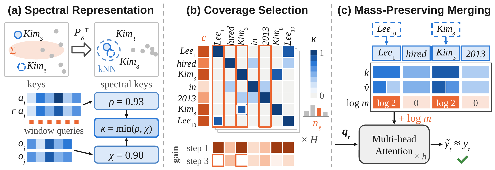

<h1 align="center">SpectralKV</h1>

<p align="center">
  <b>Redundancy-Aware KV Cache Compression via Spectral Coreset Selection</b>
</p>

<p align="center">
  Fangming Zhao<sup>1,†</sup>, Xiaofei Yue<sup>2,†</sup>, Fulun Ye<sup>1</sup>, Yu Peng<sup>1</sup>,
  Tingting Li<sup>1</sup>, Junyu Chen<sup>1</sup>, Ziming Zhao<sup>1,*</sup><br>
  <sup>1</sup>Zhejiang University &nbsp;&nbsp; <sup>2</sup>Beijing Institute of Technology<br>
  <sub><sup>†</sup>Equal contribution &nbsp;&nbsp; <sup>*</sup>Corresponding author</sub>
</p>

<p align="center">
  
  <a href="LICENSE"></a>
  
  
</p>

<p align="center">
  
</p>

Most KV cache compression methods score every cached token on its own, keep the top-scoring ones, and
delete the rest. When the input repeats itself, top-*k* keeps several copies of the same content and
throws away tokens that a kept token could have stood in for. **SpectralKV** instead compresses the
prompt cache into a *weighted coreset*: it keeps a set of representatives that together cover the
important content, and merges every other token into its representative while preserving its
attention mass.

## Highlights

- **Exact error decomposition.** Once evicted tokens can be merged, the attention-output error
  decomposes exactly over the evicted tokens, so the value of keeping a token depends on whether
  other kept tokens already represent it.
- **Coverage-based selection with a guarantee.** Representatives are chosen by importance-weighted
  coverage, jointly across the KV heads of a layer, with a $`(1-1/e)`$ greedy guarantee.
- **Mass-preserving merging.** Each merged token adds its attention mass to its representative
  through a per-row log-mass bias, which the decode kernel adds to the attention logit.
- **Strict byte budget.** The budget is counted in bytes and includes the log-masses and per-head
  metadata, so a 5% cache really occupies at most 5% of the full prompt cache.
- **One prefill, several budgets.** A single full prefill builds the compressed caches for all
  requested keep ratios, and each is decoded independently.
- **Drop-in for Llama and Qwen3.** Training-free; works with Hugging Face `transformers` models.

## Results

Across 29 datasets from LongBench and RULER, SpectralKV retains **98.1%** of the full-cache score
with 5% and 10% of the prompt cache, and outperforms the strongest of six recent eviction methods
by **3.2 points** on average. The table reports the overall score (the mean of the LongBench and
RULER averages).

| Method | Llama-3.1-8B 5% | Llama-3.1-8B 10% | Qwen3-4B 5% | Qwen3-4B 10% |
|:--|:-:|:-:|:-:|:-:|
| *Full cache* | *70.38* | *70.38* | *65.38* | *65.38* |
| SnapKV | 59.11 | 64.34 | 55.39 | 60.94 |
| CriticalKV | 57.34 | 62.00 | 55.25 | 59.85 |
| Layer-DefensiveKV | 61.13 | 68.12 | 57.09 | 63.49 |
| ReST-KV | 65.51 | 67.30 | 58.85 | 62.07 |
| Expected Attention | 27.65 | 39.19 | 32.22 | 47.27 |
| DapQ | 57.85 | 62.86 | 48.37 | 56.21 |
| **SpectralKV** | **68.79** | **69.71** | 63.27 | **64.66** |
| **SpectralKV-Fixed** | 68.75 | **69.71** | **63.45** | 64.57 |

The gains are largest where content repeats. On RULER common-word extraction with Llama-3.1-8B at
5%, SpectralKV scores **70.0**, while the best baseline scores 32.4. Per-task results for all 29
datasets are in the paper.

## How it works

<p align="center">
  
</p>

SpectralKV compresses the prompt cache of each layer once, right after prefill. The last 32 prompt
tokens (the observation window) are always kept, and their queries stand in for future decoding
queries.

1. **Spectral representation (a).** Merging token $i$ into token $j$ is exact when the attention on
   $i$ is a scaled copy of the attention on $j$. SpectralKV maps keys through the covariance spectrum
   of the window queries and values through the output projection, finds each token's nearest
   neighbors in this space, and scores how much of its contribution each neighbor recovers:
   $`\kappa = \min(\rho, \chi)`$.
2. **Coverage selection (b).** The kept sets of all KV heads in a layer maximize the
   importance-weighted coverage $`F(S) = \sum_h \sum_i c_{h,i} \max_{j \in S_h} \kappa_h(i \leftarrow j)`$
   under one shared budget, using lazy greedy on the sparse candidate graph. Heads with many
   distinct important tokens receive more slots.
3. **Mass-preserving merging (c).** Each evicted token is merged into its best representative,
   whose value becomes a weighted blend and whose log-mass $`\log m_j`$ restores the merged attention.
   A head falls back to deletion if merging does not lower its error on held-out window queries.
4. **Layer budgets.** Slots are divided among layers in proportion to how much attention varies
   across the window queries. **SpectralKV** (dynamic) measures this per input. **SpectralKV-Fixed**
   uses a profile calibrated offline per model, which lets it compress each layer as soon as its
   attention is computed. The two perform on par.

## Installation

**Requirements**

- Linux with one CUDA GPU and BF16 model weights
- Python 3.10 or newer
- A C++17 compiler (`g++`, or set `CXX`). On first use, two small CPU kernels are compiled into
  `~/.cache/spectralkv` (or `$XDG_CACHE_HOME/spectralkv`).

The tested environment is PyTorch 2.9.1, Transformers 4.57.6, Triton 3.5.1, and NumPy 2.2.6.
SpectralKV relies on the ILP64 OpenBLAS bundled with the official NumPy wheel, so install NumPy
from PyPI.

```bash
git clone https://github.com/fangming3562/spectralKV.git
cd spectralKV

# Install a CUDA build of PyTorch 2.9.1 for your CUDA version first (see pytorch.org).
pip install -r requirements.txt
pip install -e .
```

## Quick start

### Command line

```bash
spectralkv \
  --model meta-llama/Llama-3.1-8B-Instruct \
  --prompt-file prompt.txt \
  --chat-template \
  --percentages 5,10 \
  --max-new-tokens 128 \
  --output result.json
```

`python -m spectralkv` is equivalent. Useful options:

| Option | Meaning |
|:--|:--|
| `--prompt-file` / `--input-ids` | Raw text prompt, or a JSON token list (or an object with `input_ids`) |
| `--chat-template` | Wrap the text prompt in the tokenizer's chat template |
| `--percentages` | Comma-separated keep ratios in percent; all are served by one prefill |
| `--layer-budget` | `dynamic` (default) or `fixed` |
| `--profile` | Fixed layer profile: `llama31_8b`, `qwen3_4b`, or a path to a profile JSON |
| `--device` | CUDA device, default `cuda:0` |
| `--local-files-only` | Load the model and tokenizer from the local cache only |

### Python

```python
import torch
from transformers import AutoModelForCausalLM, AutoTokenizer

from spectralkv import Config, generate

name = "meta-llama/Llama-3.1-8B-Instruct"
tokenizer = AutoTokenizer.from_pretrained(name)
model = AutoModelForCausalLM.from_pretrained(
    name, dtype=torch.bfloat16, attn_implementation="sdpa"
).to("cuda").eval()

prompt = open("prompt.txt").read()
ids = tokenizer.apply_chat_template(
    [{"role": "user", "content": prompt}], tokenize=True, add_generation_prompt=True
)
input_ids = torch.tensor([ids], device="cuda")

out = generate(model, tokenizer, input_ids, config=Config(percentages=(5, 10)), max_new_tokens=128)

for pct, result in out["results"].items():
    print(f"{pct}%: {result['prediction']!r}  ({result['kv_bytes']} / {result['cap_bytes']} bytes)")
```

`generate` returns the prefill-and-compression time, the prompt length, and one entry per keep
ratio with the generated `token_ids` and `prediction`, the packed cache size `kv_bytes`, its byte
cap `cap_bytes`, the achieved `actual_ratio`, and the kept rows per layer and head (`counts`).

### Configuration

`Config` is intentionally small:

| Field | Default | Description |
|:--|:--|:--|
| `percentages` | `(5, 10)` | Keep ratios in percent (unique integers in 1–100) |
| `layer_budget` | `"dynamic"` | `"dynamic"` allocates layers per input; `"fixed"` uses a calibrated profile |
| `profile` | `None` | Fixed mode only. `None` picks the built-in profile for Llama-3.1-8B or Qwen3-4B; also accepts a profile name or JSON path |
| `layer_weights` | `None` | Fixed mode only. Explicit non-negative weight per layer, instead of a profile |

Built-in profiles for Llama-3.1-8B-Instruct and Qwen3-4B live in `src/spectralkv/profiles/` and are
checked against the model architecture before use.

### Scope of the runtime

The runtime is validated for one unpadded prompt (batch size 1) on a single CUDA device, with:

- Llama or Qwen3 architectures, BF16 weights, and `attn_implementation="sdpa"`
- head dimension 64, 128, or 256
- no model sharding or offloading, and no dynamic RoPE scaling
- one active SpectralKV runtime per process

Each budget must leave room for the 32 protected window rows of every KV head. Tokens generated
after compression are appended exactly and are not counted in the prompt budget.

## Evaluation data

`data/` contains the exact tokenized inputs used in the paper: 2,250 inputs per model, made up of
16 English LongBench tasks with 100 inputs each and 13 RULER tasks at the 16K configuration with
50 inputs each.

```text
data/
├── manifest.json          # checkpoints, sample counts, and SHA-256 of every file
├── llama/                 # meta-llama/Llama-3.1-8B-Instruct
│   ├── longbench/*.jsonl
│   └── ruler/*.jsonl
└── qwen3/                 # Qwen/Qwen3-4B (thinking mode disabled)
    ├── longbench/*.jsonl
    └── ruler/*.jsonl
```

Each line holds a complete, model-specific prompt in `input_ids` (the chat template is already
applied), the ground-truth `answers`, and the per-task generation limit `max_new_tokens`. For
example, to run every input of one task and save the predictions:

```python
import json

import torch
from transformers import AutoModelForCausalLM, AutoTokenizer

from spectralkv import Config, generate

name = "meta-llama/Llama-3.1-8B-Instruct"
tokenizer = AutoTokenizer.from_pretrained(name)
model = AutoModelForCausalLM.from_pretrained(
    name, dtype=torch.bfloat16, attn_implementation="sdpa"
).to("cuda").eval()

with open("data/llama/ruler/cwe.jsonl") as src, open("cwe_predictions.jsonl", "w") as dst:
    for line in src:
        record = json.loads(line)
        input_ids = torch.tensor([record["input_ids"]], device="cuda")
        out = generate(model, tokenizer, input_ids, config=Config(),
                       max_new_tokens=record["max_new_tokens"])
        predictions = {pct: r["prediction"] for pct, r in out["results"].items()}
        dst.write(json.dumps({"uid": record["uid"], "answers": record["answers"],
                              "predictions": predictions}) + "\n")
```

In the paper, LongBench predictions are scored with the official metric of each task and RULER
predictions by string matching. Tasks are weighted equally within each benchmark.

## Tests

```bash
pip install -e ".[dev]"

pytest -m "not cuda and not model"                 # CPU: configuration, budgets, native greedy
pytest -m cuda                                     # GPU kernels and the runtime on a tiny model
SPECTRALKV_TEST_MODEL=/path/to/Llama-3.1-8B-Instruct pytest -m model   # end-to-end on real weights
```

## Repository layout

```text
src/spectralkv/
├── api.py          # generate(): one prefill, several budgets, greedy decoding
├── cli.py          # spectralkv command-line entry point
├── config.py       # Config and fixed layer profiles
├── runtime.py      # dynamic and fixed layer pipelines
├── scoring.py      # observation-window importance and layer statistics
├── geometry.py     # spectral key-value space and candidate graph
├── selection.py    # exact sparse facility-location greedy
├── merge.py        # mass-preserving merging and per-head verification
├── operators.py    # output-projection metrics from model weights
├── kernels/        # Triton kernels: weighted-prefix decoding, geometry, scoring
├── csrc/           # C++ greedy and sparse-graph kernels, compiled on first use
└── profiles/       # calibrated layer profiles for Llama-3.1-8B and Qwen3-4B
tests/              # CPU, CUDA, and real-model tests
data/               # tokenized LongBench and RULER evaluation inputs
```

## Citation

If you find SpectralKV useful, please cite:

```bibtex
@inproceedings{zhao2026spectralkv,
  title     = {SpectralKV: Redundancy-Aware KV Cache Compression via Spectral Coreset Selection},
  author    = {Zhao, Fangming and Yue, Xiaofei and Ye, Fulun and Peng, Yu and
               Li, Tingting and Chen, Junyu and Zhao, Ziming},
  booktitle = {Advances in Neural Information Processing Systems},
  year      = {2026}
}
```

## License

SpectralKV is released under the [MIT License](LICENSE).
