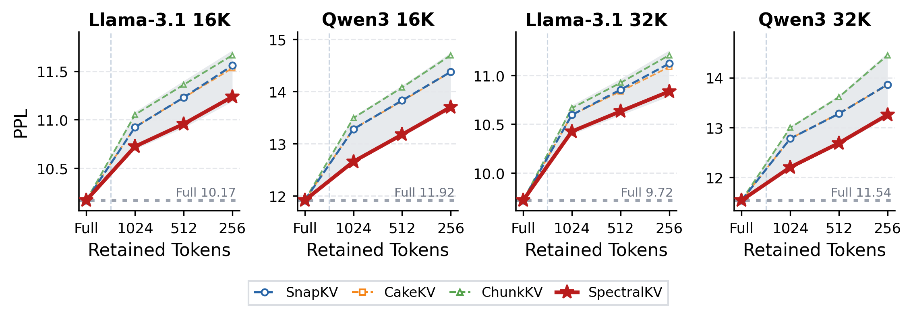
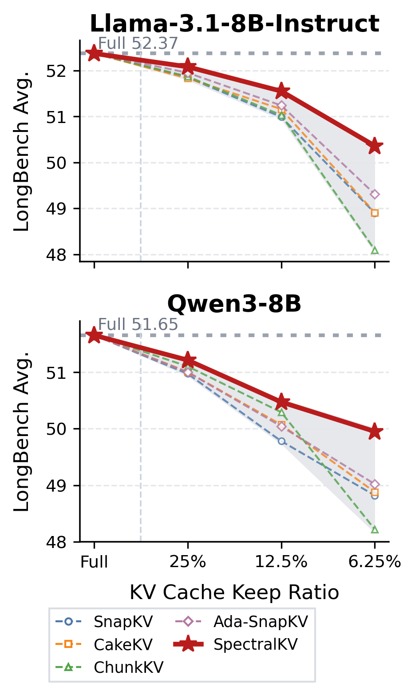
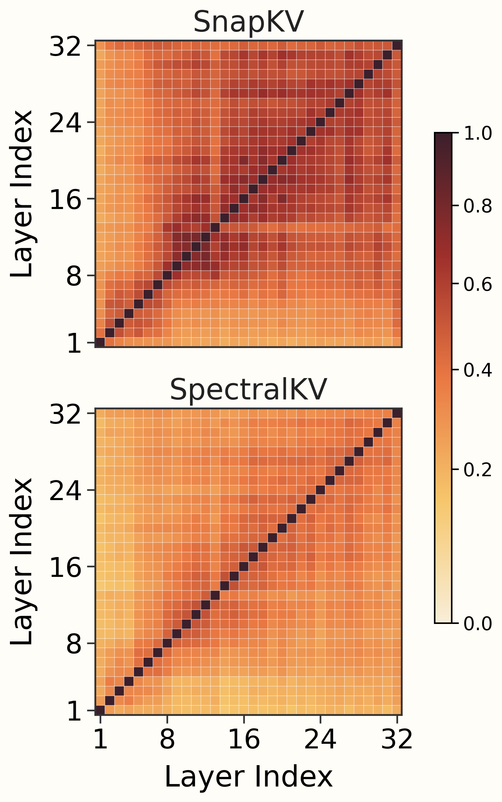
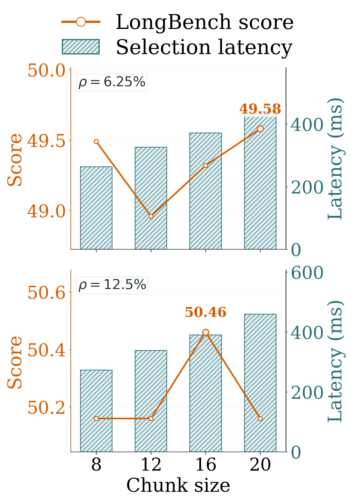

# SpectralKV

SpectralKV is a training-free KV cache compression method for long-context LLM
inference. It compresses the prompt KV cache once after prefill, then decodes
normally with new tokens appended to the compressed cache.


## Method At A Glance

SpectralKV fixes two common issues in attention top-k KV eviction.

- Uniform layer budgets waste slots on layers whose observation attention is
  flat, while sharper layers need more retained entries.
- Attention-only top-k can keep near-duplicate tokens, especially at aggressive
  keep ratios.

The method uses two coupled components.

- **Layer allocation:** compute attention concentration from shifted tail-window
  observation queries and redistribute the same per-KV-head total budget across
  layers by capped largest-remainder rounding.
- **Token selection:** build metric-aligned key-value features, allocate local
  chunk quotas by spectral water-filling, and select non-redundant tokens by
  residual pivoting.

## Results Overview

<table>
  <tr>
    <td colspan="3" align="center">
      <b>PG-19 perplexity</b><br>
      
    </td>
  </tr>
  <tr>
    <td width="33%" align="center">
      <b>LongBench keep-ratio curve</b><br>
      
    </td>
    <td width="33%" align="center">
      <b>Cross-layer overlap</b><br>
      
    </td>
    <td width="33%" align="center">
      <b>Chunk-size trade-off</b><br>
      
    </td>
  </tr>
</table>

SpectralKV preserves LongBench quality better as the keep ratio decreases and
achieves lower PG-19 perplexity than attention-ranking baselines. The overlap
figure shows that spectral coreset selection reduces repeated retention across
layers. The chunk-size sweep supports `c=16` as the default quality-efficiency
trade-off.

## Mainline Defaults

- Layer budget: attention-entropy dynamic allocation.
- Token selection: local spectral CSD key-value coreset.
- Key metric: observation-query diagonal covariance (`qcov_diag`).
- Value metric: output-projection diagonal metric (`oproj_diag`).
- Forced tokens: sink `4`, recent `8`.
- Observation window: `8`.
- Chunk size: `16`.

## Public API

```python
from spectralkv import SpectralKVConfig, prefill_compress

config = SpectralKVConfig(
    keep_ratio=0.0625,
    observation_window=8,
    force_sink=4,
    force_recent=8,
    local_chunk_size=16,
)

outputs, debug = prefill_compress(
    model=model,
    input_ids=input_ids,
    attention_mask=attention_mask,
    config=config,
)
```

The dynamic path uses attention-entropy layer allocation. For deployment-style
static budgets, first estimate a layer schedule and then use one of the static
schedule entry points:

```python
from spectralkv import (
    prefill_compress_static_schedule,
    prefill_compress_static_schedule_layerwise,
    prefill_compress_static_schedule_integrated,
)
```

Use the integrated static path when compression should happen during prefill
cache writes. Use the layer-wise static path when reducing peak prefill memory
is the main goal.

## Included Data

The repository includes the evaluation subsets used by the paper experiments.

- `data/longbench/`: 1500 LongBench examples split by task, 15 tasks x 100
  examples.
- `data/pg-19/`: actual tokenized PG-19 continuation JSONL subsets for
  Llama-3.1 and Qwen3 at 16K and 32K prompt lengths.

These files are included for reproducibility and small-scale verification. They
do not include model weights.

## Useful Scripts

Run these from the repository root.

- `scripts/profile_spectralkv_layer_schedule.sh`: estimate a static layer
  schedule from calibration prompts.
- `scripts/run_spectralkv_static_longbench.py`: evaluate static SpectralKV on
  LongBench-style prompts.
- `scripts/profile_spectralkv_three_paths_32k.py`: compare full, dynamic, and
  static/integrated prefill behavior on 32K prompts.
- `scripts/verify_spectralkv_matches_bestv12.py`: check this clean package
  against the earlier `best_v1_2` implementation under matched settings.

Older experiment scripts are not part of the package API. The maintained code
interface is `spectralkv/`.


